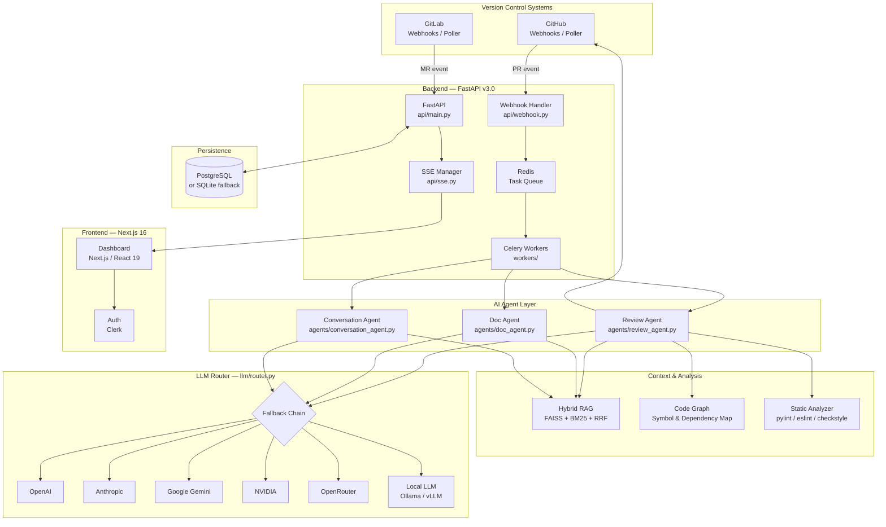
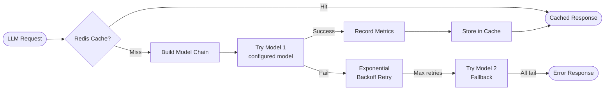
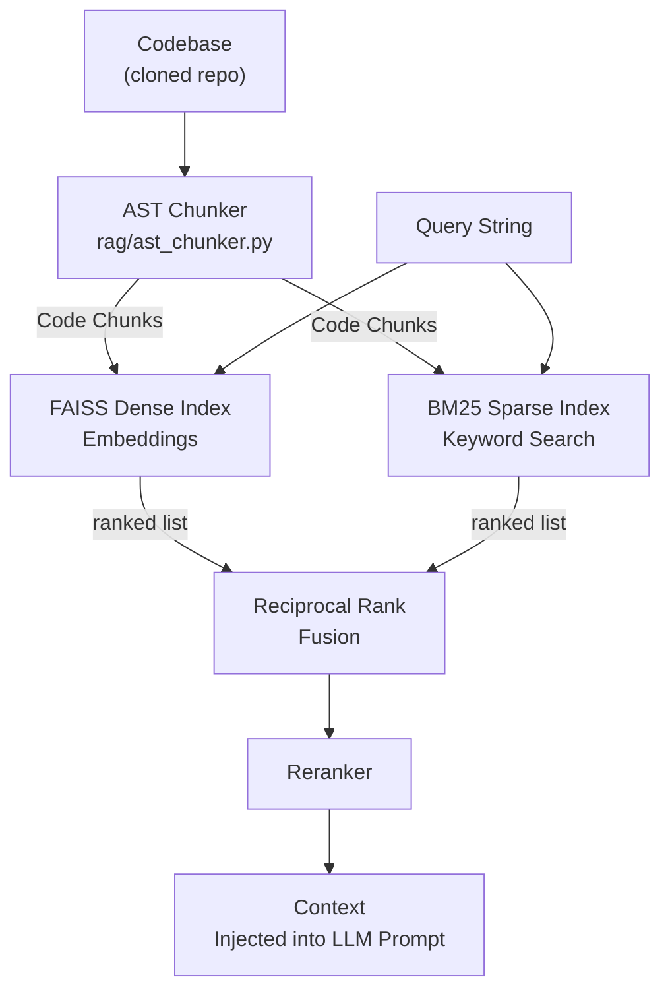

<div align="center">

# 🤖 DevAssist AI v2.0

**Autonomous Code Review & Documentation Agent**

*Powered by a resilient multi-LLM routing architecture with RAG-augmented context*

[](https://python.org)
[](https://fastapi.tiangolo.com)
[](https://nextjs.org)
[](https://redis.io)
[](https://docker.com)

</div>

---

## 📖 What is DevAssist AI?

DevAssist AI is a fully autonomous code-review and documentation platform that integrates directly into your GitHub and GitLab workflows. When a pull request is opened or updated, it:

1. **Fetches** the changed files and their diff patches.
2. **Enriches** the prompt with codebase context retrieved from a Hybrid RAG index (FAISS dense + BM25 sparse).
3. **Routes** the request through a prioritised multi-LLM fallback chain (OpenAI → Anthropic → Gemini → NVIDIA → OpenRouter → Local).
4. **Posts** inline code comments and a summary table directly on the PR — similar to CodeRabbit.
5. **Responds** conversationally when a developer replies to a bot comment.
6. **Generates** docstrings and module-level Markdown documentation after a PR is merged.

The entire backend is **async-first** (FastAPI + Celery + Redis) with PostgreSQL persistence and an optional SQLite fallback, and the frontend is a **Next.js 16 / React 19** dashboard with real-time Server-Sent Events (SSE).

---

## ✨ Key Features

| Feature | Description |
|---|---|
| 🔄 **Multi-LLM Fallback Router** | Automatically tries the next provider/model on failure with exponential backoff |
| 🔀 **Incremental Reviews** | Only reviews new commits since the last review — avoids spamming duplicate comments |
| 🧠 **Hybrid RAG Context** | FAISS (dense vector) + BM25 (keyword) + Reciprocal Rank Fusion for relevant code snippets |
| 🕸️ **Code Graph Analysis** | Builds a symbol/dependency graph of the repo to understand call chains and impact of changes |
| 🔍 **Static Analysis Integration** | Runs `pylint`, `eslint`, `checkstyle` and injects their results into the LLM prompt |
| 💬 **Conversation Agent** | Responds to developer replies on bot comments with contextual follow-up answers |
| 📝 **Doc Agent** | Auto-generates Python docstrings and Markdown module docs post-merge |
| 📊 **Analytics Dashboard** | Review counts, finding breakdown by severity & category, repository stats |
| ⚡ **SSE Live Updates** | Real-time streaming of review progress to the Next.js UI |
| 🐳 **Docker Ready** | Full `docker-compose` stack: Redis, PostgreSQL, Celery Worker |
| 🔒 **GitHub App Support** | Supports both Personal Access Token and GitHub App (bot identity) authentication |

---

## 🏗️ System Architecture

### High-Level Flow



### LLM Routing & Fallback Chain



### Hybrid RAG Pipeline



---

## 🛠️ Tech Stack

### Backend
| Layer | Technology |
|---|---|
| API Framework | FastAPI 3.0 (async) |
| Task Queue | Celery 5+ with Redis broker |
| Database | PostgreSQL 15 (SQLite fallback) |
| ORM | SQLAlchemy (async) |
| RAG — Dense | FAISS + Sentence Transformers |
| RAG — Sparse | BM25 (`rank-bm25`) |
| LLM SDKs | OpenAI, Anthropic, Google GenAI |
| Package Manager | **`uv`** (fast Python package manager) |
| Python Version | 3.11+ |

### Frontend
| Layer | Technology |
|---|---|
| Framework | Next.js 16 / React 19 |
| Language | TypeScript |
| Styling | Tailwind CSS v4 |
| UI Components | shadcn/ui |
| Auth | Clerk |
| Charts | Recharts |
| State | Zustand |

---

## 🔑 Required API Keys & Environment Variables

Copy `.env.example` to `.env` inside `devassist-ai/` and fill in the keys for your chosen provider.

### LLM Providers (at least one required)

| Provider | Env Variable | How to get |
|---|---|---|
| OpenAI | `OPENAI_API_KEY` | [platform.openai.com](https://platform.openai.com/api-keys) |
| Anthropic (Claude) | `ANTHROPIC_API_KEY` | [console.anthropic.com](https://console.anthropic.com) |
| Google Gemini | `GEMINI_API_KEY` | [aistudio.google.com](https://aistudio.google.com/app/apikey) |
| NVIDIA NIM | `NVIDIA_API_KEY` | [build.nvidia.com](https://build.nvidia.com) |
| OpenRouter | `OPENROUTER_API_KEY` | [openrouter.ai](https://openrouter.ai/keys) |
| Local (Ollama) | `LOCAL_API_BASE` | Set to `http://localhost:11434/v1`, no key needed |

### GitHub Integration (required for PR reviews)

| Variable | Description |
|---|---|
| `GITHUB_TOKEN` | Personal Access Token with `repo` scope |
| `GITHUB_REPO` | Target repository in `owner/repository-name` format |
| `WEBHOOK_SECRET` | HMAC secret to verify webhook payloads |

### Infrastructure

| Variable | Default | Description |
|---|---|---|
| `REDIS_URL` | `redis://localhost:6379/0` | Redis broker for Celery |
| `LLM_PROVIDER` | `openai` | Active provider: `openai`, `anthropic`, `gemini`, `local`, `nvidia`, `openrouter` |
| `LLM_MODEL` | `gemini-2.0-flash` | Model name for the active provider |
| `CODEBASE_PATH` | `./local_repo` | Path to the repo to index for RAG |
| `CACHE_ENABLED` | `false` | Enable Redis-based LLM response caching |

---

## 🚀 How to Run the Project

### Prerequisites

- **Python 3.11+**
- **Node.js 18+ & npm** (for the Next.js frontend)
- **`uv`** — fast Python package manager ([install guide](https://docs.astral.sh/uv/getting-started/installation/))
- **Redis** (local or via Docker)
- **Docker & Docker Compose** (optional, for the full stack)

---

### Method 1: Local Development (Manual Setup)

#### 1. Clone and navigate into the project

```bash
git clone https://github.com/Hari-Oggy/Devassist-AI.git
cd Devassist-AI/devassist-ai
```

#### 2. Install Python dependencies with `uv`

```bash
# Install uv if you haven't already
pip install uv

# Sync all dependencies from pyproject.toml / uv.lock
uv sync
```

#### 3. Configure environment variables

```bash
cp .env.example .env
# Edit .env — set LLM_PROVIDER, your API keys, GITHUB_TOKEN, GITHUB_REPO, etc.
```

#### 4. Build the FAISS / BM25 RAG index

```bash
uv run python scripts/setup_index.py
```

#### 5. Start the FastAPI backend

```bash
uv run uvicorn api.main:app --reload --port 8000
```

#### 6. Start a Celery worker (new terminal)

```bash
uv run celery -A taskqueue.celery_app worker --loglevel=info --concurrency=2
```

#### 7. Start the Next.js frontend (new terminal)

```bash
cd frontend
npm install
npm run dev
```

The frontend will be available at **http://localhost:3000**.

---

### Method 2: Using Docker (Recommended)

Spins up **Redis**, **PostgreSQL**, and a **Celery Worker** automatically:

```bash
cd devassist-ai
docker-compose up --build
```

> **Note:** The `api` service is commented out in `docker-compose.yml` by default. Start the API manually with `uv run uvicorn api.main:app --reload --port 8000` or uncomment the service block.

---

### Method 3: PowerShell Start Script (Windows)

A fully automated startup script is provided for Windows:

```powershell
cd devassist-ai
.\start.ps1
```

This script starts Redis, the FastAPI backend, a Celery worker, and the Next.js frontend automatically.

---

### Exposing the API for Webhooks (ngrok)

To receive webhook events from GitHub/GitLab on your local machine:

```powershell
# Authenticate ngrok once
ngrok config add-authtoken <your_ngrok_token>

# Start the API, then expose it
.\scripts\start-ngrok.ps1 -Target api
```

Set your GitHub/GitLab webhook URL to:
- **GitHub:** `https://<your-ngrok-url>/api/v3/github/webhook`
- **GitLab:** `https://<your-ngrok-url>/api/v3/gitlab/`

---

## 🔗 Service Endpoints

| Service | URL |
|---|---|
| **Next.js Frontend** | http://localhost:3000 |
| **FastAPI Backend** | http://localhost:8000 |
| **API Swagger Docs** | http://localhost:8000/docs |
| **Health Check** | http://localhost:8000/health |
| **SSE Live Events** | http://localhost:8000/api/v3/events/stream |

---

## 📁 Project Structure

```
devassist-ai/
├── agents/                  # AI Agent logic
│   ├── review_agent.py      # PR review (full + incremental)
│   ├── doc_agent.py         # Docstring & Markdown doc generation
│   └── conversation_agent.py# Reply to developer comments
├── api/                     # FastAPI application
│   ├── main.py              # App factory, routers, startup
│   ├── webhook.py           # GitHub webhook handler
│   ├── sse.py               # Server-Sent Events manager
│   ├── poller.py            # GitHub polling fallback
│   └── routes/              # REST endpoints (reviews, analytics, repos…)
├── analyzers/               # Static analysis orchestration
│   └── static_analyzer.py   # Parallel pylint/eslint/checkstyle runner
├── codegraph/               # Code symbol & dependency graph
│   ├── graph_builder.py     # Builds in-memory symbol graph
│   └── impact_analyzer.py   # Change impact analysis
├── core/                    # Shared config, logging, state
├── frontend/                # Next.js 16 / React 19 dashboard
│   └── src/app/             # App Router pages (dashboard, auth, integrations)
├── llm/                     # LLM routing layer
│   ├── router.py            # Central LLM router with fallback chains
│   ├── registry.py          # Model registry & capability declarations
│   └── pipeline.py          # Context distilling & finding validation
├── models/                  # SQLAlchemy database models
├── providers/               # Provider adapters
│   ├── openai_provider.py
│   ├── anthropic_provider.py
│   ├── gemini_provider.py
│   ├── nvidia_provider.py
│   ├── openrouter_provider.py
│   ├── local_provider.py
│   ├── gitlab_client.py
│   └── gitlab_webhook.py
├── prompts/                 # LLM system prompt templates
├── rag/                     # Retrieval-Augmented Generation
│   ├── hybrid_retriever.py  # FAISS + BM25 + RRF fusion
│   ├── ast_chunker.py       # AST-based code chunking
│   └── history_indexer.py   # Review history indexing
├── taskqueue/               # Celery app & task definitions
├── workers/                 # Celery task workers
│   ├── review_worker.py
│   ├── doc_worker.py
│   └── conversation_worker.py
├── docker-compose.yml       # Redis + PostgreSQL + Worker stack
├── Dockerfile               # Container image
├── pyproject.toml           # Python project metadata
├── requirements.txt         # pip-compatible dependency list
├── start.ps1                # Windows quick-start script
└── .env.example             # Environment variable template
```

---

## 📸 Screenshots


### Review Result


### Demo Video

https://github.com/user-attachments/assets/662eb92e-4f4b-46a0-9f62-921fc1873c88

---

## 🤝 Contributing

Pull requests are welcome! Please open an issue first to discuss what you'd like to change.

---

## 📄 License

MIT © [Hareesh T](https://github.com/Hari-Oggy)
